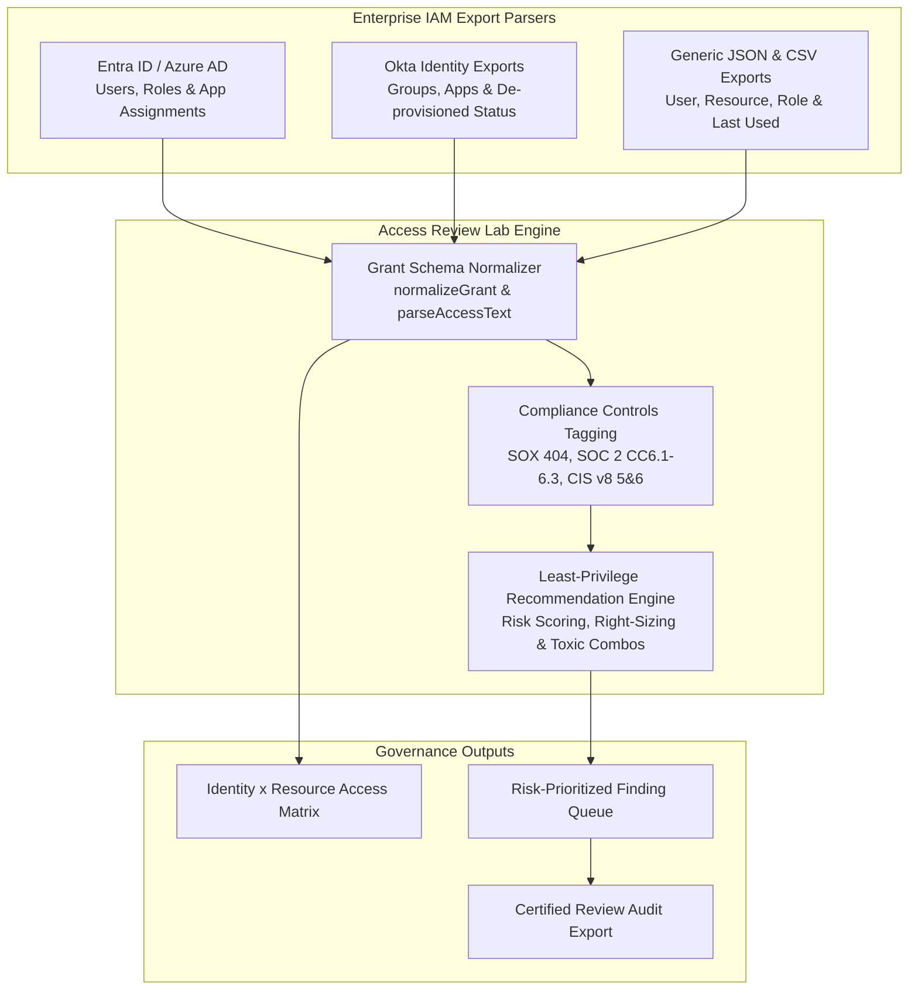

# Access Review Lab

[](https://github.com/drummer475-94/access-review-lab/actions)
[](https://github.com/drummer475-94/access-review-lab)
[](https://www.cisecurity.org/controls)
[](https://www.cisa.gov/)

Access Review Lab is an enterprise identity governance and access certification workbench. It parses native enterprise IAM export formats (Entra ID / Azure AD and Okta), tags access risks against SOX 404, SOC 2 (CC6.1–CC6.3), and CIS Controls v8 (Controls 5 & 6), and provides an automated Least-Privilege Recommendation Engine featuring privilege risk scoring, role right-sizing, toxic combination detection, and dormant user cleanup.

**[Open Live App](https://drummer475-94.github.io/access-review-lab/)**

---

## ⚡ 60-Second Quick Review Guide

1. **Scan Open Access Findings**: Load the demo access review directory to inspect 10+ pre-analyzed identity access grants across SaaS apps, cloud infrastructure, and HR suites.
2. **Review Compliance Control Tags**: Inspect findings annotated with explicit regulatory and framework tags:
   - **SOX 404**: Segregation of Duties (SoD) conflicts, access control over financial reporting systems.
   - **SOC 2 (CC6.1–CC6.3)**: Logical access restrictions, user authorization oversight, and timely revocation upon termination.
   - **CIS Controls v8 (Controls 5 & 6)**: Inactive account disabling, least-privilege enforcement, and centralized privilege management.
3. **Execute Least-Privilege Recommendations**: Evaluate numerical privilege risk scores (0–100), automated role right-sizing suggestions for non-technical or contractor accounts, and cross-system toxic role combinations.
4. **Export Audit Trail**: Record certification decisions (`Certify`, `Revoke`, `Remediate`) and export a documented JSON audit trail.

---

## Architecture & Data Flow



---

## Technical Features

- **Enterprise IAM Parsers**: Direct ingestion support for Microsoft Entra ID (userPrincipalName, assignedRoles, signInActivity) and Okta (login, status DEPROVISIONED/ACTIVE, appRole, groupMemberships).
- **Compliance Controls Tagging**:
  - **SOX 404 (Section 404 Access Controls)**: Segregation of duties, access over financial reporting systems, terminated account revocation.
  - **SOC 2 Trust Services Criteria**:
    - **CC6.1**: Logical access security and duty segregation.
    - **CC6.2**: User authorization & accountable system ownership.
    - **CC6.3**: Revocation of access upon termination & periodic access re-evaluation.
  - **CIS Controls v8**:
    - **Control 5 (Account Management)**: Inventorying accounts (5.1), managing inactive accounts (5.2), disabling terminated users (5.3).
    - **Control 6 (Access Control Management)**: Enforcing least privilege (6.1), revoking access (6.2), time-bound third-party access (6.3), centralized privileges (6.8).
- **Least-Privilege Recommendation Engine**:
  - **Privilege Risk Scoring**: Quantitative risk calculation (0–100) combining account status, privilege tier, dormancy, third-party status, and SoD conflicts.
  - **Role Right-Sizing**: Detects non-technical identities holding global/system admin roles and recommends appropriate business viewer or requester roles.
  - **Toxic Combination Detection**: Identifies cross-system incompatible role pairs (e.g. Source Control Admin + Production Cloud Console Owner).
  - **Dormant User Detection**: Pinpoints access un-utilized for 90+ / 180+ days and retained access on disabled accounts.

---

## Verification & Testing

Run unit tests and verify code coverage:

```bash
# Run unit tests across all test suites
node --test tests/*.test.js

# Run test coverage verification (>90% threshold)
node --test --experimental-test-coverage tests/*.test.js
```

---

## Professional Standards Alignment

- **SOX 404 / SOC 2 Type II**: Internal controls over financial reporting & logical access security.
- **CIS Controls v8**: Controls 5 (Account Management) & 6 (Access Control Management).
- **CISA Identity & Access Management Best Practices**: Principles of least privilege, segregation of duties, and account lifecycle management.
